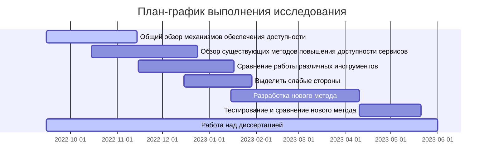

1611 - Комаров по четвергам 
29.09 - в зуме будет встреча-профориентация

Как определяется Актуальность 
| Надо                 | Есть                             |
| -------------------- | -------------------------------- |
| Потребность практики | НМА(научно методический аппарат) |

На стыке надо и есть появляются противоречия
Цель: - от практики должна быть конкретна, измерима, достижима
Сквозь цель проходит - Научная задача
Научная задача: направлена на разрешение противоречия. Методы, изученные материалы.

Гост 7.32 Система стандартов по информации, библиотечному и издательскому делу  

необходимо правильно выбирать нотацию для оформления схем 

 