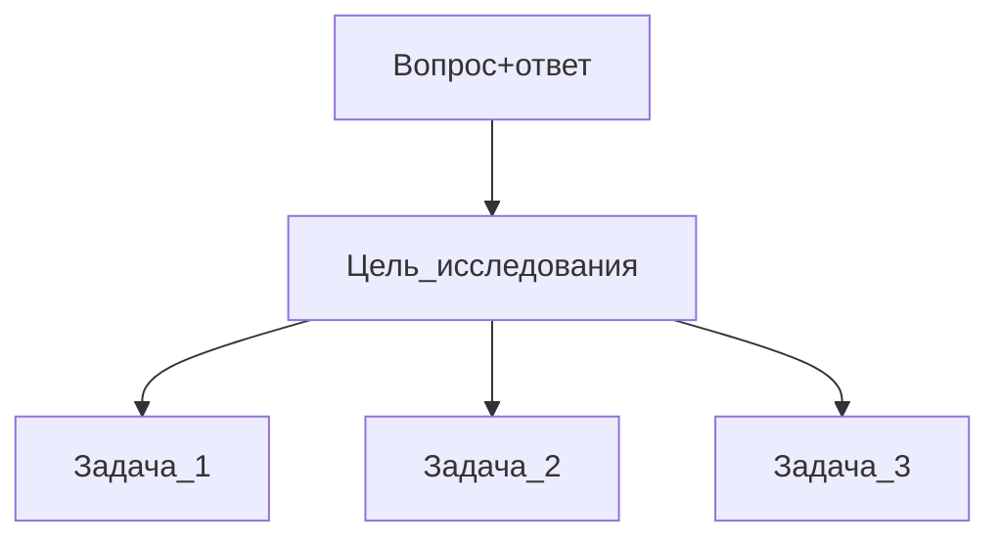

М
Н - нет известного ответа, доказательство(например апробация)
И - вопрос, ответ
# Шаг 1
Цель исследования разбивается на задачи 

#  Шаг 2
## Актуализация 
Актуализация начинается с обзор проблемы и решений.
В данном случае имеется в виду работа с **научными** источниками.
## Виды источников
- ГОСТ(стандарты)
- Учебники(методически обработанный материал) - 5-10 лет
- Научные статьи - 3-5 лет  
- Монографии 
- Диссертации(к.т.н.,д.н.) - 5-7 лет
- Патенты
- Тезисы - год
# Критерии оценивания источников
- Время
- Авторство
- Способ ...
- Фундаментальность

**Вид**|**Время**|**Авторство**|**Способ ...**| **Фундаментальность**
--- |---|---|---|---
ГОСТ(стандарты)| 5 | 1 | 0 | 2
Учебники| 4 | 1 | 0 | 1 
Научные статьи | 2 | 1 | 0 | 5
Монографии/Диссертации| 3 | 1 | 0 | 2
Патенты| 2 | 1 | 0 | 3
Тезисы| 1 | 1 | 0 | 6

## Структура статей 
1. Название
2. Авторы и аффиляция
3. Реферат/аннотация
4. Ключевые слова
5. Введение 
6. Основная часть(подразделы)
7. Заключение
8. Благодарности
9. Источники